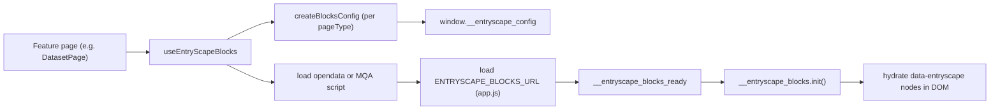

# Entryscape Blocks in this project

This document explains how the dataportal integrates **Entryscape Blocks**, where the block configurations live, and why we apply a number of custom overrides on top of the hosted bundle. Scope: enough context to onboard a developer and find the right file; not an exhaustive per-block reference.

All paths below are relative to `src/` (application source root). In code, import via the `@/` alias (e.g. `@/lib/entryscape-blocks/use-blocks`).

## 1. What Entryscape is here

Two cooperating layers are used:

- **[`@entryscape/entrystore-js`](https://www.npmjs.com/package/@entryscape/entrystore-js)** (declared in `package.json`) — a JS client used for direct Entrystore data access, SSR redirects, and the search/facet UI. This is the only Entryscape package installed as an npm dependency.
- **Entryscape Blocks** — a hosted bundle (`app.js` + an opendata or MQA extension) loaded from `static.cdn.entryscape.com` **at runtime** in the browser. The blocks library is configured through `window.__entryscape_config` and hydrates any DOM node that has a `data-entryscape="<blockName>"` attribute. Blocks is **not** an npm dependency.

Detail pages (dataset, data service, specification, concept, terminology, MQA) render their main body by placing `data-entryscape` placeholders in JSX and letting the Blocks runtime fill them in. Listing/search pages use `entrystore-js` directly and do not mount the Blocks runtime.



## 2. How blocks are loaded at runtime

The entire lifecycle lives in the [`useEntryScapeBlocks`](../src/lib/entryscape-blocks/use-blocks.ts) hook and a single DOM anchor:

- `#scriptsPlaceholder` is rendered once in the App Router chrome ([`components/layout/app-router-chrome/index.tsx`](../src/components/layout/app-router-chrome/index.tsx)) and is the container that all Entryscape `<script>` tags are appended to.
- On mount, the hook:
  1. Creates `window.__entryscape_blocks_ready` (a promise resolved by the bundle when `init` is available).
  2. Builds a config via `createBlocksConfig({ pageType, lang, env, t, context, esId, ... })` and concatenates it onto `window.__entryscape_config`.
  3. Loads the language-specific **opendata** script (`ENTRYSCAPE_OPENDATA_SV_URL` / `_EN_URL`), or the **MQA** script (`ENTRYSCAPE_MQA_SV_URL` / `_EN_URL`) when `pageType === "mqa"`.
  4. Loads the main bundle `ENTRYSCAPE_BLOCKS_URL`.
  5. Awaits `__entryscape_blocks_ready` and then calls `__entryscape_blocks.init()`.
- On unmount, the hook resets `window.__entryscape_config = []` and calls `__entryscape_blocks.clear()` so the next page starts clean.

Key snippet:

```67:113:src/lib/entryscape-blocks/use-blocks.ts
    const initializeBlocks = async () => {
      try {
        const newConfig = createBlocksConfig({
          entrystoreBase,
          env,
          lang,
          iconSize,
          t,
          pageType,
          context,
          esId,
        });

        // eslint-disable-next-line @typescript-eslint/no-explicit-any
        (window as any).__entryscape_config =
          // eslint-disable-next-line @typescript-eslint/no-explicit-any
          ((window as any).__entryscape_config || []).concat(newConfig);

        if (pageType !== "mqa") {
          await loadScript(
            lang === "sv"
              ? env.ENTRYSCAPE_OPENDATA_SV_URL
              : env.ENTRYSCAPE_OPENDATA_EN_URL,
          );
        } else {
          await loadScript(
            lang === "sv"
              ? env.ENTRYSCAPE_MQA_SV_URL
              : env.ENTRYSCAPE_MQA_EN_URL,
          );
        }

        await loadScript(env.ENTRYSCAPE_BLOCKS_URL);
```

Supporting pieces:

- **Script URLs** are read from [`env/env-settings.ts`](../src/env/env-settings.ts): `ENTRYSCAPE_BLOCKS_URL`, `ENTRYSCAPE_OPENDATA_SV_URL` / `_EN_URL`, `ENTRYSCAPE_MQA_SV_URL` / `_EN_URL`. Values vary by environment (prod vs sandbox).
- **CSP** is adjusted in [`utilities/generate-csp.ts`](../src/utilities/generate-csp.ts) to allowlist `*.entryscape.com` and `static.cdn.entryscape.com` so the hosted scripts and their XHRs are not blocked.

## 3. Where block configurations live

All block definitions live under [`lib/entryscape-blocks/`](../src/lib/entryscape-blocks). A single factory picks the right set based on `pageType`:

- [`config.ts`](../src/lib/entryscape-blocks/config.ts) — `createBlocksConfig(...)` builds the shared `block: "config"` entry (entrystore URL, `page_language`, `spa: true`, optional `context`/`entry`, `clicks`, facet `collections`, RDForms `itemstore.bundles`, `namespaces`) and returns the per-page `blocks: [...]` array.
- [`datasets.ts`](../src/lib/entryscape-blocks/datasets.ts) — dataset detail: `formatBadge`/`formatBadges2`, `distributionListCustom`, `accessServiceCustom`, `aboutDataset`, plus imports from `global.ts`.
- [`dataservice.ts`](../src/lib/entryscape-blocks/dataservice.ts) — data service detail: indicators, explore link, keyword/theme, `aboutDaservice`.
- [`apiexplore.ts`](../src/lib/entryscape-blocks/apiexplore.ts) — minimal indicator set for the API explore subpage.
- [`specification.ts`](../src/lib/entryscape-blocks/specification.ts) — `resourceDescriptors2` list with a rich `rowhead` layout for profile resources.
- [`concept.ts`](../src/lib/entryscape-blocks/concept.ts) — SKOS blocks: `broaderList`, `narrowerList`, `relatedList`, `conceptLink`, `conceptBlock`, `conceptHierarchy`.
- [`terminology.ts`](../src/lib/entryscape-blocks/terminology.ts) — terminology-specific `conceptLink`, `toppbegrepp`, `toppbegreppLista`.
- [`global.ts`](../src/lib/entryscape-blocks/global.ts) — shared blocks reused across pages: `customIndicators`, `keyword`, `theme`, `catalog`, `exploreApiLink`, `customLicenseIndicator`, `hemvist`.

MQA has no dedicated file; the MQA extension script ships the `totMQA` / `catalogMQA` blocks and we only supply the base `config` entry.

## 4. Pages that mount Entryscape Blocks

Every page that uses blocks calls `useEntryScapeBlocks` with a specific `pageType`. Placeholders are declared inline in each feature component.

- **Dataset** — [`app/[locale]/(entryscape)/_components/dataset-page/index.tsx`](<../src/app/[locale]/(entryscape)/_components/dataset-page/index.tsx>). Renders `customIndicators`, `distributionListCustom`, RDForms `view`, `autoVisualizations`, `aboutDataset`, `catalog`.
- **Dataset API explore** — [`app/[locale]/(entryscape)/_components/dataset-explore-api-page/index.tsx`](<../src/app/[locale]/(entryscape)/_components/dataset-explore-api-page/index.tsx>). Indicators + RDForms `view`.
- **Data service** — [`app/[locale]/(entryscape)/_components/data-service-page/index.tsx`](<../src/app/[locale]/(entryscape)/_components/data-service-page/index.tsx>). Indicators, `view`, `aboutDaservice`.
- **Specification** — [`app/[locale]/(entryscape)/_components/specification-page/index.tsx`](<../src/app/[locale]/(entryscape)/_components/specification-page/index.tsx>). `resourceDescriptors2`, RDForms `view`, contact dialog.
- **Concept / Terminology** — [`app/[locale]/(entryscape)/_components/concept-page/index.tsx`](<../src/app/[locale]/(entryscape)/_components/concept-page/index.tsx>). `conceptBlock`, `toppbegrepp`, `conceptHierarchy` (the same page switches `pageType` between `"concept"` and `"terminology"` based on route).
- **MQA** — [`app/[locale]/(entryscape)/metadatakvalitet/page.tsx`](<../src/app/[locale]/(entryscape)/metadatakvalitet/page.tsx>) (`totMQA`) and [`app/[locale]/(entryscape)/metadatakvalitet/[...catalog]/mqa-category-page.tsx`](<../src/app/[locale]/(entryscape)/metadatakvalitet/[...catalog]/mqa-category-page.tsx>) (`catalogMQA`).

Pages that use **Entrystore but not Blocks** (for reference, so you do not look for block configs there):

- Search/listing pages under [`src/app/[locale]/(entryscape)/_search/`](../src/app/[locale]/(entryscape)/_search/) — use [`providers/search-provider/index.tsx`](../src/providers/search-provider/index.tsx) with direct `entrystore-js` queries.
- [`app/[locale]/(entryscape)/_components/organisation-page/index.tsx`](<../src/app/[locale]/(entryscape)/_components/organisation-page/index.tsx>) — custom React UI.
- [`app/[locale]/(entryscape)/_components/dataset-series-page/index.tsx`](<../src/app/[locale]/(entryscape)/_components/dataset-series-page/index.tsx>) — `SearchProvider` for series members.

## 5. Types of customizations and why we do them

The hosted blocks cover most of the content, but the portal has a distinct design system, Next.js routing, and Swedish/English terminology. Four override techniques are used.

### 5.1 Template extensions (`extends: "template"`)

Handlebars-like templates that slot custom HTML and classes into the block's output. Used when we keep the block's data logic but want a different DOM shape so Tailwind utilities apply cleanly.

Example: `conceptBlock` in [`lib/entryscape-blocks/concept.ts`](../src/lib/entryscape-blocks/concept.ts) composes its own `<h2>` / `<div>` structure around `{{text}}`, `{{#ifprop}}`, and nested blocks like `{{broaderList}}`.

### 5.2 List customizations (`extends: "list"`)

The built-in `list` block is extended with custom `rowhead`, `rowexpand`, `listbody`, `listplaceholder`, `expandTooltip`, and translated labels. This is how lists of distributions, resource descriptors, narrower concepts, and top concepts render in our layout while still using Blocks for data binding.

Example: `distributionListCustom` in [`lib/entryscape-blocks/datasets.ts`](../src/lib/entryscape-blocks/datasets.ts) builds a flex container, embeds an RDForms `{{view rdformsid="dcat:Distribution" filterpredicates="..."}}` inside the expanded row, and uses translated tooltips.

### 5.3 Imperative `run` blocks

For anything that needs the concrete `Entry` (context id, localized label, license URI) or has to produce non-trivial DOM, blocks are defined with a `run(node, ..., entry)` function and `loadEntry: true`. This gives us an imperative hook while still participating in the Blocks lifecycle.

Used for:

- **Internal Next.js links** — `conceptLink` writes a same-origin anchor so users stay inside the app. The URL is assembled through the shared `includeLangInPath()` helper so it collapses to `/concepts/…` for Swedish (default locale, no prefix) and `/en/concepts/…` once the route is re-enabled under `app/[locale]/`:

```39:63:src/lib/entryscape-blocks/concept.ts
  {
    block: "conceptLink",
    run: (node: any, a2: any, a3: any, entry: Entry) => {
      if (node?.firstElementChild && entry) {
        const baseUrl = window.location.origin;
        const el = document.createElement("a");

        node.setAttribute("class", "entryscape");

        node.firstElementChild.appendChild(el);

        const label = getLocalizedValue(
          entry.getAllMetadata(),
          "skos:prefLabel",
        );
        el.innerHTML = label;
        const uri = `${baseUrl}${includeLangInPath(lang)}${conceptsPathResolver(
          entry,
        )}`;
        el.setAttribute("href", uri);
      }
    },
    loadEntry: true,
  },
```

- **License rendering** — `customLicenseIndicator` maps license URIs to CC badges / SVGs.
- **Explore API button** — `exploreApiLink` builds a CTA that deep-links into the API explore subpage.
- **Publisher / "hemvist" resolution** — `hemvist` looks up the owning organization from the Entry's graph.

All four live in [`lib/entryscape-blocks/global.ts`](../src/lib/entryscape-blocks/global.ts).

### 5.4 i18n, CSS, and navigation overrides

- **Translations.** `next-intl`'s `t(...)` is threaded through `createBlocksConfig` and embedded directly in template strings (labels, tooltips, expand/collapse buttons, section headings), so block text matches the site's translations instead of Blocks' defaults.
- **Styling.** [`styles/entryscape.css`](../src/styles/entryscape.css) and [`styles/entryscape-mqa.css`](../src/styles/entryscape-mqa.css) (imported via `src/styles/main.css`) restyle Entryscape's generated markup — `.rdforms*`, `.entryscape` links/headings, `.esbRowHead`, `.concept_hierarchy`, etc. — primarily with Tailwind `@apply` so hosted output aligns with the design system.
- **Navigation workaround.** Blocks hydrates state tied to the current page. To avoid stale state when users click a link rendered inside a block, `useEntryScapeBlocks` installs a document-level click listener that intercepts same-origin anchors and forces `window.location.href = link.href` (full navigation) instead of Next's client-side routing:

```40:49:src/lib/entryscape-blocks/use-blocks.ts
    const handleClick = (event: MouseEvent) => {
      const link = (event.target as HTMLElement).closest("a");

      if (link && link.href.startsWith(window.origin)) {
        event.preventDefault();
        window.location.href = link.href;
      }
    };

    document.addEventListener("click", handleClick);
```

This is a trade-off: we lose client-side transitions between entryscape-mounted pages but gain guaranteed clean re-initialization of the blocks runtime.

## 6. Quick file map

- [`hooks/use-entry-scape-blocks.ts`](../src/lib/entryscape-blocks/use-blocks.ts) — script loader, lifecycle, click workaround.
- [`lib/entryscape-blocks/config.ts`](../src/lib/entryscape-blocks/config.ts) — `createBlocksConfig` factory; per-page `config` entries.
- [`lib/entryscape-blocks/datasets.ts`](../src/lib/entryscape-blocks/datasets.ts) — dataset blocks (distributions, formats, about).
- [`lib/entryscape-blocks/dataservice.ts`](../src/lib/entryscape-blocks/dataservice.ts) — data service blocks.
- [`lib/entryscape-blocks/apiexplore.ts`](../src/lib/entryscape-blocks/apiexplore.ts) — API explore indicators.
- [`lib/entryscape-blocks/specification.ts`](../src/lib/entryscape-blocks/specification.ts) — specification resource list.
- [`lib/entryscape-blocks/concept.ts`](../src/lib/entryscape-blocks/concept.ts) — SKOS concept blocks and hierarchy.
- [`lib/entryscape-blocks/terminology.ts`](../src/lib/entryscape-blocks/terminology.ts) — terminology list/link blocks.
- [`lib/entryscape-blocks/global.ts`](../src/lib/entryscape-blocks/global.ts) — shared indicators, license, explore link, hemvist.
- [`components/layout/app-router-chrome/index.tsx`](../src/components/layout/app-router-chrome/index.tsx) — `#scriptsPlaceholder` anchor.
- [`env/env-settings.ts`](../src/env/env-settings.ts) — `ENTRYSCAPE_*` script URLs.
- [`utilities/generate-csp.ts`](../src/utilities/generate-csp.ts) — CSP allowlist.
- [`styles/entryscape.css`](../src/styles/entryscape.css), [`styles/entryscape-mqa.css`](../src/styles/entryscape-mqa.css) — visual overrides.
- [`lib/entrystore/provider/index.tsx`](../src/lib/entrystore/provider/index.tsx) — Entrystore context for entryscape pages (separate from the blocks runtime).
- [`app/[locale]/(entryscape)/_components/*`](<../src/app/[locale]/(entryscape)/components>) — pages that mount blocks.

## 7. Known inconsistency worth verifying

`entrystoreBase` is passed differently to `useEntryScapeBlocks` on the two MQA pages:

- [`app/[locale]/(entryscape)/metadatakvalitet/page.tsx`](<../src/app/[locale]/(entryscape)/metadatakvalitet/page.tsx>) passes a full URL: `https://${env.ENTRYSCAPE_MQA_PATH}/store`.
- [`app/[locale]/(entryscape)/metadatakvalitet/[...catalog]/mqa-category-page.tsx`](<../src/app/[locale]/(entryscape)/metadatakvalitet/[...catalog]/mqa-category-page.tsx>) passes a bare hostname: `env.ENTRYSCAPE_MQA_PATH`.

Both values end up in the same `baseConfig.entrystore` field in `createBlocksConfig`. This is a candidate for normalization (pick one form and fix the other), but it is out of scope for this documentation.
