# Next 16 + App Router + gqlFetch migration

Incrementally upgrade to Next 16 / React 19, replace Apollo Client with a plain `gqlFetch` helper, migrate to the App Router, switch i18n from next-translate to next-intl, and push as much rendering as possible into React Server Components.

> **Note:** this plan was originally scoped to Next 15. By the time Phase 2 landed, Next 16 was stable and is a small hop from 15 (mostly App Router async-request tightening + Turbopack default for `next build`). We target 16 to avoid a near-term re-upgrade. Filename is kept for continuity.

## Target end state

- Next `^16`, React `^19`, TypeScript unchanged, Node `>=20` recommended.
- No `@apollo/client`, no `apollo` CLI. All GraphQL traffic goes through a single `graphql/fetcher.ts` (`gqlFetch<TData, TVars>(doc, vars, { revalidate, tags, cache })`) that works on server and client.
- No `pages/` directory. All routing under `app/[locale]/...` with `next-intl`.
- Data fetching happens in **Server Components** by default. Client Components only where strictly required: state, effects, browser APIs, Entryscape, Matomo, Swagger UI, react-player, react-vis, focus-trap, cookie banner, interactive nav.

## Architecture

```mermaid
flowchart LR
  subgraph Server [Server Components / Route Handlers]
    Layout[app/&#91;locale&#93;/layout.tsx<br/>html + metadata]
    Page[app/&#91;locale&#93;/.../page.tsx<br/>RSC]
    Helpers[utilities/query-helpers.ts<br/>plain async fns]
    Fetcher[graphql/fetcher.ts<br/>gqlFetch]
    MW[middleware.ts<br/>next-intl + CSP nonce]
  end
  subgraph Client [Client Components]
    Providers[providers/app-router-providers/index.tsx<br/>Settings/LocalStore/Tracking]
    Chrome[Header/Sidebar/<br/>Breadcrumbs/Hero/CookieBanner]
    Features[Entryscape blocks,<br/>search UI, forms, charts]
  end
  Backend["GraphQL API<br/>(APOLLO_URL)"]

  MW --> Layout
  Layout --> Providers
  Providers --> Chrome
  Layout --> Page
  Page --> Helpers
  Helpers --> Fetcher
  Features --> Fetcher
  Fetcher -->|"fetch + next cache"| Backend
```



## Phase 1 - Kill Apollo on the Pages Router (prep, lands first)

Goal: remove Apollo without touching routing. This de-risks everything after.

- Add `graphql/fetcher.ts` exporting `gqlFetch<TData, TVars>(doc, vars, opts)`:
  - Uses `print(doc)` from `graphql` to serialize the existing `DocumentNode`s.
  - URL resolution: `typeof window === "undefined" ? process.env.APOLLO_URL : reactEnv("APOLLO_URL")`.
  - Maps `opts.revalidate`, `opts.tags`, `opts.cache` onto `fetch(..., { cache, next })`.
  - Inspects `json.errors` and throws a `GqlError` with the array attached.
  - Runs an `addTypename(doc)` transform before `print` that walks every non-root `SelectionSet` and injects `__typename` if missing. This replicates Apollo's default `InMemoryCache({ addTypename: true })` behavior which the codebase still depends on for runtime union/interface discrimination (e.g. `item.__typename === "dataportal_Digg_Tool"` in `components/grid-list`). Cached per-`DocumentNode` via a `WeakMap`. Slated for removal in Phase 5 once codegen bakes `__typename` into the documents at build time.
- Port every call site in `utilities/query-helpers.ts` (14 `client.query` + 1 `browserclient.query`) and `utilities/form-utils.ts` (`fetchFortroendemodellenForm`) to `gqlFetch`. Keep the existing `{ props, revalidate, notFound }` return shape for now so `getStaticProps` pages keep working.
- Remove `<ApolloProvider>` from `pages/_app.tsx` and `pages/_document.tsx`. Nothing inside uses `useQuery`/`useMutation`/`useApolloClient`, confirmed by grep.
- Delete `graphql/client.ts`.
- `package.json`: remove `@apollo/client` and `apollo`. Replace `graphql:introspect` with a `graphql-codegen` introspection config (one-file change in `codegen.ts`).
- If `gql` from `@apollo/client` is imported inside `graphql/*.ts`, swap to `graphql-tag` (or move codegen to the `typed-document-node` preset to skip `gql` tags entirely).
- Ship as its own PR. Cypress + `yarn build` must pass before Phase 2.

## Phase 2 - Next 15 + React 19 upgrade (still Pages Router)

- `yarn up next@^15 react@^19 react-dom@^19 eslint-config-next@^15 @types/react@^19 @types/react-dom@^19`.
- Run `npx @next/codemod@canary upgrade latest`.
- Fix known breakages:
  - `next.config.js`: `images.domains` -> `images.remotePatterns`; drop `env.REVALIDATE_INTERVAL` (read `process.env` directly in server code).
  - Audit `fetch` callers for cache-default changes (Next 15 no longer caches by default). Pass explicit `cache` / `next.revalidate` in `gqlFetch`.
  - React 19: remove any `forwardRef` that became redundant, deal with `useRef(null)` stricter typing if it surfaces.
- Smoke: `yarn build`, `yarn check-types`, `yarn lint`, Cypress.

## Phase 3 - Shell: `app/[locale]/layout.tsx` + providers + middleware

Split into two PRs because each item has a very different blast radius:

- **3a — Infra scaffold** (landed): `proxy.ts` + `next-intl` middleware, `i18n/{routing,request}.ts`, `app/layout.tsx` + `app/[locale]/layout.tsx`, `providers/app-router-providers/index.tsx`, `LayoutStateProvider`, error/not-found shells, `pages/_app.tsx` refactor. Coexists with `pages/` — no route ported yet, no UI regression expected.
- **3b — Full `next-translate` → `next-intl` migration** (landed): rewrote every `t("ns|key$sub")` call site to native `next-intl` dot notation (`t("ns.key.sub")`), deleted `next-translate` + `next-translate-plugin`, and unwound its `next.config` wrapper. Localized `pathnames` wiring from `routes.json` still pending (deferred into Phase 4 where per-route porting happens anyway).

### Phase 3a — what shipped (and pragmatic deviations from the original plan)

- `proxy.ts`:
  - `next-intl/middleware` with `locales: ["sv", "en"]`, `defaultLocale: "sv"`, `localePrefix: "as-needed"`. _Deviation:_ the original plan said `"always"` "matches current `localeDetection: false` behavior" — that's wrong. The legacy hand-rolled proxy stripped `/sv/` and only prefixed English (`as-needed` semantics). Switching to `"always"` would force `/sv/datasets` everywhere and break every existing URL/bookmark. We use `as-needed`.
  - Per-request CSP nonce stamped on both the **request** header (so RSCs can read via `headers()`) and the **response** header. The locale layout falls back to a freshly minted nonce if the header is missing.
- `i18n/routing.ts` exports a single `routing` object (DRY: middleware + request config + future `Link`/`navigation` helpers all consume it).
- `i18n/request.ts`: `getRequestConfig` preloads all five namespaces (`common`, `pages`, `resources`, `routes`, `filters`) per locale. Messages keep their legacy `|`/`$` keys for now — the 3b codemod replaces them.
- `next.config.mjs`: wrapped with `createNextIntlPlugin("./i18n/request.ts")`. The plugin order matters: `nextTranslate(withNextIntl(coreConfig), { turbopack: true })` — `next-intl` first so it doesn't see the legacy `i18n` key that `next-translate` injects.
- Also added `serverExternalPackages: ["winston", "@alfalab/winston3-logstash-transport"]` to fix a Phase 2 fallout: `pages/_error.tsx → utilities/logger.ts → winston/...` was pulling Node-only `net`/`tls`/`fs` into the browser bundle under Turbopack. `_error.tsx` itself was tightened to dynamically import the logger behind `typeof window === "undefined"` with `webpackIgnore` / `turbopackIgnore` hints.
- `app/layout.tsx`: minimal passthrough (`return children`). _Deviation:_ original plan implied a single root layout owning `<html>` — but `<html lang={locale}>` must be dynamic, so the locale layout below owns it instead. Documented Next-intl pattern.
- `app/[locale]/layout.tsx` (RSC):
  - Owns `<html lang>`, `<body>`, the screen9 stylesheet, preconnects, `theme-color`, and `/__ENV.js` (loaded `beforeInteractive` with the CSP nonce).
  - `generateStaticParams()` pre-renders both locales.
  - Validates `params.locale` and calls `notFound()` for unknown values.
  - Wraps children in `<AppRouterProviders>`.
- `providers/app-router-providers/index.tsx` (`"use client"`, exports `AppRouterProviders`): wraps `NextIntlClientProvider`, `SettingsProvider`, `LocalStoreProvider`, `LayoutStateProvider`, `MatomoProvider`. `EnvSettings` is created client-side via `useEffect` because `react-env` reads `window.__beam_env` populated by `/__ENV.js`. Until env hydrates, `SettingsUtil.getDefault()` is used so SSR markup doesn't drift.
- `providers/layout-state-provider/`: holds `settingsOpen`, `openSideBar`, `imageHero`, `breadcrumbState`, with both their setters. `pages/_app.tsx` reads from it via `useLayoutState()` and bridges `setBreadcrumb` into `SettingsContext` so the 14 existing pages that call `setBreadcrumb?.({...})` keep working unchanged.
- `pages/_app.tsx`: split into `Dataportal` (outer, renders `LayoutStateProvider`) and `DataportalChrome` (inner, consumes the hook and renders `Settings/LocalStore/Matomo` + chrome). Top-level `useRouter()` from `next/router` removed — the hash effect now reads `props.router.asPath` instead.
- `app/[locale]/not-found.tsx`, `app/[locale]/error.tsx`, `app/global-error.tsx`: minimal shells; `global-error.tsx` ships its own `<html>/<body>` because it triggers when the root layout itself crashes.

_Pragmatic deviation — `next/router` → `next/navigation` sweep:_ the original plan said "replace every `next/router` import" in this phase. We deferred everything except `pages/_app.tsx`. The other ~38 callers all live inside Pages-Router-only files (`pages/`, `features/`); each will be ported alongside its page during Phase 4, when the surrounding component model also changes. Doing them eagerly here would make a 30-file mechanical PR that has no observable effect (all those files still render under `pages/` for now).

### Phase 3b — what shipped

- **No JSON changes needed.** `locales/**/*.json` files were already nested — the `|`/`$` syntax only existed in call sites. Only the translation call sites needed rewriting.
- **Call-site rewrite** (~330 calls across 77 files): `useTranslation("ns")` → `useTranslations()` + `useLocale()` from `next-intl`; `t("ns|key$sub", {vars})` → `t("ns.key.sub", {vars})`; `t("resources|<uri>")` → dedicated `useResourceLabel()` (client) / `getResourceLabel()` (server) helpers because the `resources` namespace uses URIs containing `.` and `/` as keys, which collide with `next-intl`'s dot-path resolver. `SearchProvider` (class component) got a thin functional wrapper that injects hooks; `EntrystoreService` (pure class) now takes `t` + `resourceLabel` as constructor deps.
- **URI-keyed resources travel out-of-band.** `next-intl` validates message keys at load time and throws `INVALID_KEY` on any `.` or `/` in a namespace path, so the `resources` namespace (URIs like `http://purl.org/dc/terms/license`) can't ride inside the `NextIntlClientProvider` message tree. `i18n/load-messages.ts#loadLocaleMessages` returns the four safe namespaces (`common`, `pages`, `filters`, `routes`); a sibling `loadResourceLabels` returns the URI map separately. `i18n/resources-provider.tsx` stores it in its own React context; `useResourceLabel` / `getResourceLabel` read from that context and completely bypass `next-intl`. Both `app/[locale]/layout.tsx` and `pages/_app.tsx` load messages + resources in one `Promise.all`, pass messages to `NextIntlClientProvider` and resources to `ResourcesProvider` wrapping it. Same rationale forced the removal of the unused `filters.allchecktext` subtree (it keyed on URIs too). **Implication for Phase 4:** any new Entryscape/SKOS label you'd have added to `resources` still goes in `locales/{sv,en}/resources.json`; don't try to fold it into `common` or `filters`.
- **Pages Router = Swedish-only during the migration (Option B).** We initially kept Next's native `i18n: { locales, defaultLocale, localeDetection: false }` block to preserve `/en` on Pages Router, but Next 16 logs a hard deprecation warning whenever that option is combined with the App Router, and `next-intl` adds its own warning on top — so the block is now gone. Every Pages Router component reads `useLocale()` from `next-intl` (which resolves to `routing.defaultLocale` outside `app/[locale]/`), `pages/_app.tsx` hard-codes `locale = routing.defaultLocale` in `getInitialProps`, and `/en/*` on the Pages Router effectively 404s until each route family moves under `app/[locale]/` in Phase 4. `proxy.ts` stays nonce-only; `NextIntlClientProvider` is still mounted in `pages/_app.tsx` with messages preloaded via `loadLocaleMessages`, so all Swedish copy and SSR continue to work.
- **URL builders go through `includeLangInPath()`.** All hardcoded `` `/${lang}/…` `` interpolations (main-nav logo + search form, `pages/_app.tsx` search destination, `entrystore-provider` terminology links, `entrystore-helpers` dataset + external-spec URLs) now route through `utilities/check-lang.ts#includeLangInPath(lang)`, which returns `""` for the default locale and `` `/${lang}` `` otherwise. Same shape means Swedish URLs collapse to `/datasets/…` today (matching the route with the `i18n` block gone) and restore to `/en/datasets/…` per-family during Phase 4 without another edit. The `common.lang-path` translation key (which stored `"/sv"` / `"/en"` purely to build URLs) has been deleted from both locale JSONs; the sidebar "home" active-state check reads `includeLangInPath()` directly. **Rule for Phase 4:** never interpolate `` `/${lang}/…` `` by hand — always go through the helper, otherwise the link will 404 for the default locale.
- **ICU + `t.raw` gotchas.** `next-translate`'s `{{variable}}` placeholder syntax is silently incompatible with `next-intl`; messages load fine but throw `INVALID_MESSAGE: MALFORMED_ARGUMENT` at render time. All single-brace conversions (`{variable}`) are applied in `locales/{sv,en}/pages.json`. A second class of breakage: messages that contain raw HTML tags (the `pages.search.search-${mode}-tips-text` copy has `<div>…<li><p>` with class attributes). Plain `t(…)` parses those as rich-text tags and rejects attributes → `INVALID_TAG`. Those call sites use `t.raw(…)` (in `features/search/search-filters/index.tsx`), which skips ICU parsing and returns the string verbatim. Dynamic keys need `as Parameters<typeof t>[0]` when going through `t.raw`.
- **`timeZone` must be set explicitly.** `use-intl` throws `ENVIRONMENT_FALLBACK` during SSR if no `timeZone` is configured (server + client must agree to avoid hydration mismatch). Set to `"Europe/Stockholm"` in three places — `NextIntlClientProvider` in `providers/app-router-providers/index.tsx` (App Router), `NextIntlClientProvider` in `pages/_app.tsx` (Pages Router), and the object returned from `getRequestConfig` in `i18n/request.ts` (RSC loader). Keep those three in sync if the default ever changes.
- **Server-side helpers.** `i18n/get-translations.ts` (mirrors `useTranslations` for `getServerSideProps`), `i18n/get-resource-label.ts` (mirrors `useResourceLabel`), and `i18n/load-messages.ts` (single source for loading all five namespaces). Used by `utilities/entrystore/entrystore-redirect.ts` among others.
- **Biome guardrail.** `biome.json` bans every `next-translate/*` import via `noRestrictedImports` so legacy calls can't sneak back.
- `next-translate`, `next-translate-plugin`, `i18n.js`, and the matching Dockerfile copy are all deleted.
- **Type-safe `t()` keys.** `i18n/messages.d.ts` augments `use-intl`'s `AppConfig` with `Locale = "sv" | "en"` and `Messages = { common, pages, filters, routes }` (sourced from the Swedish JSON — default locale is the schema of record; `resources` is intentionally excluded since it's URI-keyed and bypassed by `useResourceLabel`). `Translate` is now `ReturnType<typeof useTranslations<never>>` so helper signatures (`createBlocksConfig`, `EntrystoreService`, `SearchProvider`, the server helpers) get end-to-end autocomplete + typo-checking for every `t("…")` literal. Turning this on surfaced ~110 stale call sites the codemod missed — stray `$`/`:` separators, bare `common.*` keys missing their prefix, `search$*` translation-key constants, and a `common.language` key that never existed — all fixed. Dynamic keys (`` `filters.group.${groupName}` ``, `` `pages.${searchMode}.search` ``) use `as Parameters<typeof t>[0]` at the call site; `URL_BADGE_MAP` in `search-hit` moved to `as const satisfies` so its values type-narrow into valid keys automatically.

### Phase 3b — deferred

- `next-intl` `pathnames` derived from `locales/{sv,en}/routes.json` (localized slugs `/datasets` ↔ `/en/data-apis`). Rolled into Phase 4 — each route family gets its `pathnames` entry added when it's ported to `app/[locale]/`. Now that the native Pages Router `i18n` block is gone (Option B), `next-intl` middleware can safely be reintroduced in `proxy.ts` alongside the nonce work as the first App Router route lands.
- **Re-enabling `/en`.** Until a route moves under `app/[locale]/`, `/en/*` on Pages Router returns a 404. Each Phase 4 PR that ports a route family is responsible for verifying the English variant for that family.

At the end of Phase 3 (3a + 3b), `pages/` still owns every route, all i18n flows through `next-intl`, and the Swedish UI is unchanged. English is temporarily unavailable on Pages Router routes and gets restored per-family during Phase 4.

## Phase 4 - Port routes family by family

Migrate one route family per PR. Each PR: create `app/[locale]/<segment>/page.tsx`, port data loading, delete the old `pages/` file, update any hard-coded links.

Suggested order (smallest blast radius first):

- Static / simple: `/404` (done in phase 3), `/api/healthcheck` -> `app/api/healthcheck/route.ts`, `/api/auth` -> `app/api/auth/route.ts`, `/sitemap.xml` -> `app/sitemap.ts`, `/robots` if present.
- Start + landing: `pages/index.ts` -> `app/[locale]/page.tsx`; `features/pages/start-page`, `features/pages/landing-page`, `features/pages/container-page`, `features/pages/list-page`, `features/pages/form-page` become server components with a thin client child for interactive pieces.
- CMS content: `pages/nyheter`, `pages/goda-exempel`, `pages/stod-och-verktyg`, `pages/[...containerSlug]`.
- Fortroendemodellen tree (`pages/fortroendemodellen/*`).
- Entryscape route families one at a time: `datasets`, `dataservice`, `concepts`, `specifications`, `terminology`, `organisations`, `metadatakvalitet`, `dataset-series`, `externalconcept`, `externalspecification`, `externalterminology`, `drafts`.

For each page:

- `getStaticProps({ locale, params })` -> call the same helper directly inside the RSC `page.tsx`. Helpers in `utilities/query-helpers.ts` lose their `{ props, revalidate, notFound }` wrapper and return data or throw; the page does `if (!data) notFound()`.
- `getStaticPaths` -> `export async function generateStaticParams()`.
- `revalidate: N` -> `export const revalidate = N` at module scope, or pass `{ next: { revalidate: N } }` in `gqlFetch`.
- SEO (today via `resolvePage` + `<MetaData>`) -> `export async function generateMetadata()`; delete the `<MetaData>` component once all routes are ported.
- Swap the Pages-Router-only i18n bridges for the native `next-intl/server` APIs once the caller lives inside `app/`: `@/i18n/get-translations` → `getTranslations({ locale })` from `next-intl/server`, `@/i18n/get-resource-label` → `getMessages({ locale })` narrowed to `.resources`. The custom helpers only exist because `next-intl/server`'s `getTranslations` is stubbed to throw outside the `react-server` condition (i.e. from `getServerSideProps`/`getInitialProps`); they become deletable once `utilities/entrystore/entrystore-redirect.ts` and its callers are RSCs.
- Mark as `"use client"` only the subtrees that genuinely need it:
  - Entryscape blocks / `useEntryScapeBlocks` (DOM-bound Entryscape JS library).
  - Search UI (`features/search/**`), filters, URL state via `nuqs`.
  - Forms (`features/pages/form-page`, `fortroendemodellen`).
  - Charts (`react-vis`), `swagger-ui-react`, `react-player`, `focus-trap-react`, cookie banner, Matomo tracker.

Default rule of thumb: if a component doesn't import `react`'s state/effect hooks and doesn't touch `window`, it stays on the server.

## Phase 5 - Clean up and hardening

- Delete `pages/_app.tsx`, `pages/_document.tsx`, and the now-empty `pages/` directory.
- Remove the remaining webpack `resolve.fallback` block unless a dep still needs it (verify with a production build). (`next-translate` + plugin already gone in Phase 3b.)
- Keep the SVGR rule in `next.config.js`; verify it still runs under Next 15 / Turbopack. If Turbopack is enabled (`next dev --turbopack`), move SVGR to the Turbopack `rules` config.
- Audit `"use client"` boundaries: any provider or pure-display component that accidentally got marked client can often be pushed back to the server.
- Add tags to `gqlFetch` calls that change via CMS (`navigation`, `start-page`, `container:<slug>`) and expose a `/api/revalidate` Route Handler using `revalidateTag` for webhook-driven invalidation, replacing the ISR-only model.
- Update `docs/entryscape-blocks.md` to describe the client-boundary model.
- Run the full Cypress suite; compare Lighthouse numbers against pre-migration baseline (LCP, CLS, TBT).

## Phase 6 - `lib/` consolidation (optional, post-migration cleanup)

Goal: finish the move started by `lib/matomo/` in Phase 2. Pull third-party integrations out of `utilities/` and `hooks/` into self-contained `lib/<integration>/` modules so the public API of each integration is a single import surface and route-local code in `app/` only imports from stable, well-named entry points.

Rule of thumb:

- `lib/<name>/` = integration with side effects, singletons, external services, or SDK wrappers (stable public API per folder).
- `utilities/` = pure helpers only — no React, no network, no module-scope state.

Scope:

- **`utilities/entrystore/*` → `lib/entrystore/`** (biggest win). Includes `entrystore.service.ts`, `entrystore-helpers.ts`, `entrystore-redirect.ts`, `local-cache.ts`, plus `types/entrystore-js.d.ts` and `types/entrystore-core.ts` colocated as `lib/entrystore/types.ts`. Optionally move `providers/entrystore-provider/` into the same folder so the lib is fully self-contained (one `@/lib/entrystore` import surface).
- **`utilities/entryscape/blocks/*` → `lib/entryscape-blocks/`**. Colocate `hooks/use-entry-scape-blocks.ts` as `lib/entryscape-blocks/use-blocks.ts` — that hook has no meaning outside this integration.
- **Optional:** move `providers/api-index-context/` next to whichever lib owns its data source (if it talks to an external index API).
- **Leave alone:** `graphql/` (conventional top-level + codegen config points at it), `env/`, `types/` global ambient decls, pure helpers in `utilities/` (`checkers`, `date-helper`, `form-utils`, `query-helpers`, `dcat-utils`, `data-categories`, `key-generator`, `scroll-helper`, `route-helpers`, `app`), generic `hooks/*`, `providers/*` that hold pure app state (`settings`, `local-store`, `search`).
- **Borderline:** `utilities/generate-csp.ts` (pure function but all third-party origins — move only if CSP grows beyond one file), `utilities/logger.ts` (move if it starts forwarding to Sentry/Datadog).

Sequencing:

- Do NOT do this during Phase 4 — moving files while porting routes multiplies diff conflicts.
- One focused PR per integration after the App Router port is stable:
  - PR A: `utilities/entrystore/*` → `lib/entrystore/*` (mechanical: `git mv` + alias-aware find/replace on `@/utilities/entrystore`).
  - PR B: `utilities/entryscape/blocks/*` + `use-entry-scape-blocks` → `lib/entryscape-blocks/*`.
- Each PR is just renames + import path rewrites; Biome and `yarn check-types` flag stale imports immediately. No behavior change.

End-state example:

```
lib/
├── matomo/                    # Phase 2 (done)
├── entrystore/                # PR A
│   ├── client.ts              # ← entrystore.service.ts
│   ├── helpers.ts             # ← entrystore-helpers.ts
│   ├── redirect.ts            # ← entrystore-redirect.ts
│   ├── local-cache.ts
│   ├── types.ts               # ← types/entrystore-*
│   ├── entrystore-provider.tsx (optional co-locate)
│   └── index.ts
└── entryscape-blocks/         # PR B
    ├── blocks/                # ← utilities/entryscape/blocks/*
    ├── config.ts
    ├── use-blocks.ts          # ← hooks/use-entry-scape-blocks.ts
    └── index.ts
```

## Risks and open items

- **next-intl + localized slugs.** `locales/sv/routes.json` encodes localized paths (e.g. `datasets` -> `/data-apier`). These must be expressed in `next-intl`'s `pathnames` config; otherwise links break. Deferred into Phase 4 — each route gets its pathname entry added when ported to `app/`.
- **`/en` is temporarily 404 on Pages Router.** Consequence of Option B. Each Phase 4 route-family PR is responsible for bringing its English variant back up the moment the route lands under `app/[locale]/`, and verifying both locales before merging. Until then, the language toggle in the header will bounce English users to a not-found page — acceptable during migration, but keep an eye on analytics.
- **URL construction must use `includeLangInPath`.** Any `` `/${lang}/…` `` template the migration didn't catch will 404 in Swedish (since the default locale has no prefix now). A lint rule for this would be nice but is hard to express in Biome; for now, code review + the prescriptive note in Phase 3b is the guardrail.
- **`@beam-australia/react-env` + RSC.** `/__ENV.js` must still load before any client provider reads `reactEnv(...)`. Layout injects the script with the CSP nonce; runtime env stays runtime.
- **Entryscape library.** Browser-only, DOM-dependent. All `useEntryScapeBlocks` consumers must be Client Components, loaded via `next/dynamic(..., { ssr: false })` where hydration would otherwise race the library's DOM mounting.
- **Apollo cache wasn't doing anything.** Confirmed by code search: no hooks, no reactive vars, every query used `no-cache`. Removing Apollo is safe.
- **Node version.** Next 16 wants Node 20.9+ (Dockerfile already on `node:22-alpine`, local Node is v24). Bump `engines.node` to `>=20` in `package.json`.

## Todo checklist

- [x] **Phase 1:** add `graphql/fetcher.ts` (`gqlFetch`) and port all `query-helpers` + `form-utils` call sites off Apollo.
- [x] **Phase 1:** remove `ApolloProvider` from `_app`/`_document`, delete `graphql/client.ts`, drop `@apollo/client` + `apollo` deps, switch introspect to `graphql-codegen`.
- [x] **Phase 2:** upgrade to Next 16 / React 19 on the Pages Router, run Next codemods, fix `images.remotePatterns` and `fetch` cache defaults.
- [x] **Phase 3a:** extend `proxy.ts` (next-intl + CSP nonce), add `i18n/{routing,request}.ts`, `app/layout.tsx` + `app/[locale]/layout.tsx`, `providers/app-router-providers/index.tsx`, `LayoutStateProvider`, not-found/error pages, refactor `pages/_app.tsx` onto `LayoutStateProvider`. _Per-page `next/router` → `next/navigation` sweep deferred to Phase 4._
- [x] **Phase 3b:** rewrite every `t("ns|key$sub")` call (~330 across 77 files) to native `next-intl` dot notation; introduce `useResourceLabel` / `getResourceLabel` for the URI-keyed `resources` namespace (delivered via its own `ResourcesProvider` context to avoid `INVALID_KEY` validation); drop `next-translate` + plugin; drop the native Pages Router `i18n` block (Option B — Pages Router is Swedish-only during the migration, `useLocale()` everywhere, all URL builders routed through `includeLangInPath()`, `common.lang-path` key deleted); fix ICU placeholders (`{{var}}` → `{var}`), switch HTML-bearing translations to `t.raw`, pin `timeZone: "Europe/Stockholm"` on both providers + `getRequestConfig`; add Biome `noRestrictedImports` guardrail. Localized `pathnames` + re-enabling `/en` deferred into Phase 4 (per-route).
- [x] **Phase 4 (step 1+2):** port static/API/sitemap routes to `app/` (`app/api/auth/route.ts`, `app/api/healthcheck/route.ts`, `app/sitemap.xml/route.ts`) and align the 404 pair (`app/not-found.tsx` + `app/[locale]/not-found.tsx`). Fixed a silent sitemap regression where dropping the Pages Router `i18n` block left `getServerSideProps({ locales })` undefined — now iterates `routing.locales` explicitly.
- [x] **Phase 4 (step A):** port the App Router chrome. `components/layout/app-router-chrome/` hosts Header / Sidebar / Footer / Breadcrumbs / CookieBanner / SkipToContent. `AppRouterProviders` now wraps `SettingsProvider` in a `SettingsLayoutBridge` so `setBreadcrumb` from `LayoutStateProvider` flows through `SettingsContext` unchanged (matches the Pages Router chrome bridge in `pages/_app.tsx`). `app/[locale]/layout.tsx` fetches `navigationData` server-side and hands it to the chrome. Hero + `<MetaData>` deliberately NOT in the chrome — Hero becomes a page-owned component in the RSC world, `<MetaData>` is replaced by per-page `generateMetadata()`. A throwaway `app/[locale]/page.tsx` stub (`notFound()` → later `Hello World`) activated the `[locale]` segment so Next routed `/sv/whatever` 404s through `app/[locale]/not-found.tsx`; replaced by the real start page in step C.
- [x] **Phase 4 (step B — CSP to middleware):** move Content-Security-Policy generation into `proxy.ts` and emit it as a response header ([Next.js CSP guide](https://nextjs.org/docs/app/guides/content-security-policy)). Middleware now stamps both `x-nonce` and `Content-Security-Policy` on request + response. With the header present, Next auto-applies the nonce to framework scripts and route bundles (those render outside React hydration and dodge the CSP-spec nonce-strip issue). Companion changes: (a) `utilities/generate-csp.ts` now takes `imageDomain` / `apolloUrl` as args instead of calling `@beam-australia/react-env`, so it's safe to import from the edge bundle; (b) `pages/_document.tsx` reads `x-nonce` from `ctx.req` and feeds the same nonce into `<Head>` / `<NextScript>` / `/__ENV.js`, so Pages Router scripts pass the response-header policy; (c) the `<meta http-equiv="Content-Security-Policy">` tag in `components/meta-data/index.tsx` is deleted to avoid dueling policies (browsers apply the intersection of header + meta); (d) `app/[locale]/layout.tsx` emits `/__ENV.js` as a raw `<script nonce={…} suppressHydrationWarning>` rather than `next/script` because of [vercel/next.js#86330](https://github.com/vercel/next.js/pull/86330) — the App Router `<Script>` currently renders an internal `self.__next_f.push(...)` sidecar whose nonce hydrates empty, causing a mismatch; using a plain `<script>` avoids the sidecar, and `suppressHydrationWarning` silences the attribute diff on the external script itself (the React-docs-sanctioned escape hatch for deliberate server/client attribute gaps caused by browsers wiping `nonce` per [CSP3 spec](https://www.w3.org/TR/CSP3/#is-element-nonceable)). Revisit and switch back to `<Script>` once #86330 (or its successor) ships. Matcher updated to skip `next/link` prefetches per the Next guide. Forces dynamic rendering on all pages — which we were already doing via `headers()` + `getNavigationData()`, so no net change.
- [x] **Phase 4 (step C — start page):** port `pages/index.ts` → `app/[locale]/page.tsx`. Page is an RSC that awaits `getStartPage(locale)`, renders `<Hero>` + `<StartPage>`, and replaces `<MetaData>` with a per-page `generateMetadata()` (title, description, OG, Twitter, canonical, robots gated on `envName === "prod"`). `features/pages/start-page/index.tsx` gets `"use client"` — it uses `next/dynamic({ ssr: false })` for the statistics island plus `useTranslations` / `useResourceLabel` / `usePathname`, so it can't run on the server anyway. `components/layout/hero/` is now a **pure Server Component** — no hooks, no async, no `"use client"`. It takes `isFrontpage?: boolean` from the caller (Pages Router `_app.tsx` passes `pathname === "/"`, App Router page passes `true`) instead of sniffing `usePathname()` itself. The interactive bits (search shortcut buttons + form `useState`) move into `components/layout/hero/hero-search.tsx` (`"use client"`), which `<Hero>` mounts as a client leaf. `components/button/` is fully RSC-safe — no hooks, no context, no client-component children. The icon size used to come from `SettingsContext.iconSize` (responsive to root font-size) via an inner `IconLabel` client wrapper, but that pattern broke the moment a Server Component tried `<Button icon={SomeSvg}>` because component references can't cross the RSC → CC prop boundary. The icon JSX is now rendered inline inside `<Button>` / `<ButtonLink>` with the same default sizing the context dance produced (16 / 24 px). The `iconSize` font-scaling tweak is gone for now; revisit if we miss it. `proxy.ts` now rewrites `/` → `/${routing.defaultLocale}` internally so Swedish users keep landing on the bare root URL but the App Router start page serves them — this is the incremental stand-in for `createMiddleware(routing)`, which we can't run yet because it would also rewrite `/datasets` → `/sv/datasets` and break every Pages Router route still owning its un-prefixed URL. Full `next-intl` middleware comes back the moment all Swedish routes live under `app/[locale]/`. `pages/index.ts` deleted.
- [x] **Phase 4 (CMS routes):** port list pages, publication detail pages, container/landing pages, and statistics to `app/[locale]/`. `features/pages/list-page/index.tsx` migrated from `next/router` to `next/navigation` (`useSearchParams` + `useRouter` + `usePathname`). `features/statistic/statistic-page/index.tsx` migrated likewise (drop `next/router`, drop `<Head>`). `proxy.ts` expanded to rewrite all non-Entryscape Swedish paths to `/${defaultLocale}${path}`. Created RSC pages: `nyheter/page.tsx` + `nyheter/[slug]/page.tsx`, `stod-och-verktyg/page.tsx`, `exempel-pa-ateranvandning/page.tsx` + `[slug]/page.tsx`, `exempel-datadriven-transformation/page.tsx` + `[slug]/page.tsx`, `statistik/page.tsx`, `statistics/page.tsx`, `[...containerSlug]/page.tsx`. Each page calls its query helper, renders `<Hero>` (server-rendered), and delegates to the existing `"use client"` feature component. `generateMetadata()` replaces `<MetaData>`. Old `pages/` files deleted. Breadcrumbs render once in `app-router-chrome` (outside `<main>`, conditional on `breadcrumbState.crumbs.length > 0 && pathname !== "/"`), matching the Pages Router `_app.tsx` architecture exactly — no per-page breadcrumb components needed. `<main>` keeps its `mt-lg md:mt-xl` top margin. The deleted `components/navigation/page-breadcrumbs/` experiment was removed in favor of this simpler approach.
- [x] **Phase 4:** port fortroendemodellen tree and form pages.
- [x] **Phase 4 (Entryscape routes):** port all Entryscape route families to `app/[locale]/`. Created 29 RSC pages: search index pages (`datasets`, `concepts`, `specifications`, `organisations`, `search`), detail pages with Entryscape blocks (`datasets/[dataSet]`, `dataservice/[dataSet]`, `organisations/[org]`, `dataset-series/[id]`), detail pages with redirect handling (`concepts/[concept]`, `specifications/[spec]`, `terminology/[term]` + nested `[param]`), permanent redirects for legacy `/name/` URLs, external resource redirects (`externalconcept`, `externalspecification`, `externalterminology`), MQA pages (`metadatakvalitet` + `[...catalog]`), API explorer (`datasets/[dataSet]/apiexplore/[apieid]`), and drafts. Each page calls its query helper directly, uses `generateMetadata()` for SEO, and delegates to the existing `"use client"` feature component. Migrated 14 feature files from `next/router` to `next/navigation` (`useRouter`, `usePathname`, `useParams`, `useSearchParams`). Migrated all `next/head` → React 19 native `<title>`/`<meta>` tag hoisting. Made `handleEntryStoreRedirect` and `handleLocale` router-agnostic with a generic `RouterLike` interface. `proxy.ts` `PAGES_ROUTER_PREFIXES` reduced to just `"fortroendemodellen"`. Old `pages/` files for all ported routes deleted.
- [x] **Phase 4 (flatten query-helpers):** query helpers now return data directly (or `null` for not-found cases) instead of the legacy `{ props, revalidate, notFound }` shape. Removed `withRevalidate`, `notFound`, and `revalidateValue` helpers. Removed `revalidate` from `QueryOptions`. All App Router pages add `export const revalidate = parseInt(process.env.REVALIDATE_INTERVAL || "60", 10)` at module scope. Pages Router survivors (`pages/_app.tsx`, `pages/drafts/index.tsx`) updated to wrap results for `getServerSideProps` compatibility.
- [x] **Phase 5:** ~~delete `pages/`~~, removed `PAGES_ROUTER_PREFIXES` from `proxy.ts`, removed `iconSize` DOM calculation from `SettingsProvider` (hardcoded to 16), converted `StatisticPage` + 12 Entryscape redirect/detail pages from `"use client"` to server components, added `BreadcrumbSetter` + `buildBreadcrumb` server-side breadcrumb pattern.
- [x] **Phase 5 (remaining):** audited `"use client"` boundaries (all 13 feature components legitimately need it), added `/api/revalidate` route handler with `revalidateTag`, updated `docs/entryscape-blocks.md` (stale `pages/_app.tsx` and `next-translate` references). Lighthouse comparison still pending.
- [x] **Phase 5:** migrated GraphQL layer to `@graphql-codegen/typed-document-node`. Added `typed-document-node` plugin to `codegen.ts`, regenerated `graphql/__generated__/operations.ts` (now exports `TypedDocumentNode` constants), updated `graphql/fetcher.ts` to accept `TypedDocumentNode | DocumentNode`, and converted all 20 call sites (`query-helpers.ts`, `form-utils.ts`, `healthcheck/route.ts`, `sitemap.xml/route.ts`) to use typed documents — removing explicit `<TData, TVars>` generics. Runtime `addTypename` transform kept (plain `typed-document-node` preset does not inject `__typename`).
  - If we adopt `preset: "client"` with `documentMode: "string"` (the "other project" setup), codegen will bake `__typename` into every operation/fragment at build time. At that point, delete the `addTypename(doc)` transform in `graphql/fetcher.ts` — it becomes redundant and just adds latency per request.
  - If we stop at the plain `typed-document-node` preset, `__typename` is **not** injected (that preset only emits `TypedDocumentNode<TData, TVars>` types around the existing source) and the runtime `addTypename` transform in `gqlFetch` must stay.
  - Either way, verify post-migration by diffing an outgoing request body against a pre-migration capture: `__typename` selections must still be present on every nested selection set, otherwise `components/grid-list` and any other discriminator-based component will silently render the wrong variant.
- [x] **Phase 6:** moved `utilities/entrystore/*` → `lib/entrystore/*`, colocated `types/entrystore-core.ts`, `types/entrystore-js.d.ts`, and `providers/entrystore-provider/` → `lib/entrystore/provider/`. Moved `utilities/entryscape/blocks/*` → `lib/entryscape-blocks/*` and renamed `hooks/use-entry-scape-blocks.ts` → `lib/entryscape-blocks/use-blocks.ts`. All import paths updated across ~30 files.
