# Next 16 + App Router + gqlFetch migration

Incrementally upgrade to Next 16 / React 19, replace Apollo Client with a plain `gqlFetch` helper, migrate to the App Router, switch i18n from next-translate to next-intl, and push as much rendering as possible into React Server Components.

> **Note:** this plan was originally scoped to Next 15. By the time Phase 2 landed, Next 16 was stable and is a small hop from 15 (mostly App Router async-request tightening + Turbopack default for `next build`). We target 16 to avoid a near-term re-upgrade. Filename is kept for continuity.

## Target end state

- Next `^16`, React `^19`, TypeScript unchanged, Node `>=20` recommended.
- No `@apollo/client`, no `apollo` CLI. All GraphQL traffic goes through a single `graphql/fetcher.ts` (`gqlFetch<TData, TVars>(doc, vars, { revalidate, tags, cache })`) that works on server and client.
- No `pages/` directory. All routing under `app/[locale]/...` with `next-intl`.
- Data fetching happens in **Server Components** by default. Client Components only where strictly required: state, effects, browser APIs, Entryscape, Matomo, Swagger UI, react-player, react-vis, focus-trap, cookie banner, interactive nav.

## Architecture

```mermaid
flowchart LR
  subgraph Server [Server Components / Route Handlers]
    Layout[app/&#91;locale&#93;/layout.tsx<br/>html + metadata]
    Page[app/&#91;locale&#93;/.../page.tsx<br/>RSC]
    Helpers[utilities/query-helpers.ts<br/>plain async fns]
    Fetcher[graphql/fetcher.ts<br/>gqlFetch]
    MW[middleware.ts<br/>next-intl + CSP nonce]
  end
  subgraph Client [Client Components]
    Providers[components/providers.tsx<br/>Settings/LocalStore/Tracking]
    Chrome[Header/Sidebar/<br/>Breadcrumbs/Hero/CookieBanner]
    Features[Entryscape blocks,<br/>search UI, forms, charts]
  end
  Backend["GraphQL API<br/>(APOLLO_URL)"]

  MW --> Layout
  Layout --> Providers
  Providers --> Chrome
  Layout --> Page
  Page --> Helpers
  Helpers --> Fetcher
  Features --> Fetcher
  Fetcher -->|"fetch + next cache"| Backend
```



## Phase 1 - Kill Apollo on the Pages Router (prep, lands first)

Goal: remove Apollo without touching routing. This de-risks everything after.

- Add `graphql/fetcher.ts` exporting `gqlFetch<TData, TVars>(doc, vars, opts)`:
  - Uses `print(doc)` from `graphql` to serialize the existing `DocumentNode`s.
  - URL resolution: `typeof window === "undefined" ? process.env.APOLLO_URL : reactEnv("APOLLO_URL")`.
  - Maps `opts.revalidate`, `opts.tags`, `opts.cache` onto `fetch(..., { cache, next })`.
  - Inspects `json.errors` and throws a `GqlError` with the array attached.
  - Runs an `addTypename(doc)` transform before `print` that walks every non-root `SelectionSet` and injects `__typename` if missing. This replicates Apollo's default `InMemoryCache({ addTypename: true })` behavior which the codebase still depends on for runtime union/interface discrimination (e.g. `item.__typename === "dataportal_Digg_Tool"` in `components/grid-list`). Cached per-`DocumentNode` via a `WeakMap`. Slated for removal in Phase 5 once codegen bakes `__typename` into the documents at build time.
- Port every call site in `utilities/query-helpers.ts` (14 `client.query` + 1 `browserclient.query`) and `utilities/form-utils.ts` (`fetchFortroendemodellenForm`) to `gqlFetch`. Keep the existing `{ props, revalidate, notFound }` return shape for now so `getStaticProps` pages keep working.
- Remove `<ApolloProvider>` from `pages/_app.tsx` and `pages/_document.tsx`. Nothing inside uses `useQuery`/`useMutation`/`useApolloClient`, confirmed by grep.
- Delete `graphql/client.ts`.
- `package.json`: remove `@apollo/client` and `apollo`. Replace `graphql:introspect` with a `graphql-codegen` introspection config (one-file change in `codegen.ts`).
- If `gql` from `@apollo/client` is imported inside `graphql/*.ts`, swap to `graphql-tag` (or move codegen to the `typed-document-node` preset to skip `gql` tags entirely).
- Ship as its own PR. Cypress + `yarn build` must pass before Phase 2.

## Phase 2 - Next 15 + React 19 upgrade (still Pages Router)

- `yarn up next@^15 react@^19 react-dom@^19 eslint-config-next@^15 @types/react@^19 @types/react-dom@^19`.
- Run `npx @next/codemod@canary upgrade latest`.
- Fix known breakages:
  - `next.config.js`: `images.domains` -> `images.remotePatterns`; drop `env.REVALIDATE_INTERVAL` (read `process.env` directly in server code).
  - Audit `fetch` callers for cache-default changes (Next 15 no longer caches by default). Pass explicit `cache` / `next.revalidate` in `gqlFetch`.
  - React 19: remove any `forwardRef` that became redundant, deal with `useRef(null)` stricter typing if it surfaces.
- Smoke: `yarn build`, `yarn check-types`, `yarn lint`, Cypress.

## Phase 3 - Shell: `app/[locale]/layout.tsx` + providers + middleware

Coexists with `pages/` - no route ported yet.

- Add `middleware.ts`:
  - `next-intl/middleware` with `locales: ["sv", "en"]`, `defaultLocale: "sv"`, `localePrefix: "always"` (matches current `localeDetection: false` behavior), plus a localized `pathnames` map generated from `locales/sv/routes.json` / `locales/en/routes.json` so `/datasets` <-> `/data-apier` continues to work.
  - Generate per-request CSP nonce, set on `x-nonce` request header.
- Add `i18n/request.ts` (`next-intl` `getRequestConfig`) pointing at `locales/{locale}/{namespace}.json`. Flatten the custom `|` / `$` separators to standard nested JSON as part of this phase (one-time script; keys in code like `t("pages|startpage$search_placeholder")` get rewritten to `t("pages.startpage.search_placeholder")`).
- Add `app/[locale]/layout.tsx` as a Server Component:
  - Owns `<html lang>`, `<head>`, Matomo base tag, screen9 stylesheet, `/__ENV.js` script with nonce, `theme-color`, fonts.
  - Reads nonce from `headers()`.
  - Uses `NextIntlClientProvider` with messages from the request config.
  - Static layout chrome (Header shell, Footer, Hero outer) stays server-rendered; interactive sub-components are Client Components.
- Add `components/providers.tsx` marked `"use client"`:
  - Wraps `SettingsProvider`, `LocalStoreProvider`, `MatomoProvider` (`@/lib/matomo`), `NextIntlClientProvider` for client consumers.
- Move the shared layout state (`breadcrumbState`, `imageHero`, `openSideBar`, `settingsOpen`) out of `pages/_app.tsx` into a new `LayoutStateProvider` client context so it survives the move off `_app`.
- Replace every `next/router` import with `next/navigation` (`useRouter`/`usePathname`/`useSearchParams`); replace `router.events.on("routeChangeComplete", ...)` (Matomo) with an effect on `[pathname, searchParams]`.
- Add `app/[locale]/not-found.tsx`, `app/[locale]/error.tsx`, `app/global-error.tsx`.

At the end of Phase 3, `pages/` still owns every route. No UI should have regressed.

## Phase 4 - Port routes family by family

Migrate one route family per PR. Each PR: create `app/[locale]/<segment>/page.tsx`, port data loading, delete the old `pages/` file, update any hard-coded links.

Suggested order (smallest blast radius first):

- Static / simple: `/404` (done in phase 3), `/api/healthcheck` -> `app/api/healthcheck/route.ts`, `/api/auth` -> `app/api/auth/route.ts`, `/sitemap.xml` -> `app/sitemap.ts`, `/robots` if present.
- Start + landing: `pages/index.ts` -> `app/[locale]/page.tsx`; `features/pages/start-page`, `features/pages/landing-page`, `features/pages/container-page`, `features/pages/list-page`, `features/pages/form-page` become server components with a thin client child for interactive pieces.
- CMS content: `pages/nyheter`, `pages/goda-exempel`, `pages/stod-och-verktyg`, `pages/[...containerSlug]`.
- Fortroendemodellen tree (`pages/fortroendemodellen/*`).
- Entryscape route families one at a time: `datasets`, `dataservice`, `concepts`, `specifications`, `terminology`, `organisations`, `metadatakvalitet`, `dataset-series`, `externalconcept`, `externalspecification`, `externalterminology`, `drafts`.

For each page:

- `getStaticProps({ locale, params })` -> call the same helper directly inside the RSC `page.tsx`. Helpers in `utilities/query-helpers.ts` lose their `{ props, revalidate, notFound }` wrapper and return data or throw; the page does `if (!data) notFound()`.
- `getStaticPaths` -> `export async function generateStaticParams()`.
- `revalidate: N` -> `export const revalidate = N` at module scope, or pass `{ next: { revalidate: N } }` in `gqlFetch`.
- SEO (today via `resolvePage` + `<MetaData>`) -> `export async function generateMetadata()`; delete the `<MetaData>` component once all routes are ported.
- Mark as `"use client"` only the subtrees that genuinely need it:
  - Entryscape blocks / `useEntryScapeBlocks` (DOM-bound Entryscape JS library).
  - Search UI (`features/search/**`), filters, URL state via `nuqs`.
  - Forms (`features/pages/form-page`, `fortroendemodellen`).
  - Charts (`react-vis`), `swagger-ui-react`, `react-player`, `focus-trap-react`, cookie banner, Matomo tracker.

Default rule of thumb: if a component doesn't import `react`'s state/effect hooks and doesn't touch `window`, it stays on the server.

## Phase 5 - Clean up and hardening

- Delete `pages/_app.tsx`, `pages/_document.tsx`, and the now-empty `pages/` directory.
- Remove `next-translate`, `next-translate-plugin`; remove its wrapper from `next.config.js`. Remove the webpack `resolve.fallback` block unless a dep still needs it (verify with a production build).
- Keep the SVGR rule in `next.config.js`; verify it still runs under Next 15 / Turbopack. If Turbopack is enabled (`next dev --turbopack`), move SVGR to the Turbopack `rules` config.
- Audit `"use client"` boundaries: any provider or pure-display component that accidentally got marked client can often be pushed back to the server.
- Add tags to `gqlFetch` calls that change via CMS (`navigation`, `start-page`, `container:<slug>`) and expose a `/api/revalidate` Route Handler using `revalidateTag` for webhook-driven invalidation, replacing the ISR-only model.
- Update `docs/entryscape-blocks.md` to describe the client-boundary model.
- Run the full Cypress suite; compare Lighthouse numbers against pre-migration baseline (LCP, CLS, TBT).

## Phase 6 - `lib/` consolidation (optional, post-migration cleanup)

Goal: finish the move started by `lib/matomo/` in Phase 2. Pull third-party integrations out of `utilities/` and `hooks/` into self-contained `lib/<integration>/` modules so the public API of each integration is a single import surface and route-local code in `app/` only imports from stable, well-named entry points.

Rule of thumb:

- `lib/<name>/` = integration with side effects, singletons, external services, or SDK wrappers (stable public API per folder).
- `utilities/` = pure helpers only — no React, no network, no module-scope state.

Scope:

- **`utilities/entrystore/*` → `lib/entrystore/`** (biggest win). Includes `entrystore.service.ts`, `entrystore-helpers.ts`, `entrystore-redirect.ts`, `local-cache.ts`, plus `types/entrystore-js.d.ts` and `types/entrystore-core.ts` colocated as `lib/entrystore/types.ts`. Optionally move `providers/entrystore-provider/` into the same folder so the lib is fully self-contained (one `@/lib/entrystore` import surface).
- **`utilities/entryscape/blocks/*` → `lib/entryscape-blocks/`**. Colocate `hooks/use-entry-scape-blocks.ts` as `lib/entryscape-blocks/use-blocks.ts` — that hook has no meaning outside this integration.
- **Optional:** move `providers/api-index-context/` next to whichever lib owns its data source (if it talks to an external index API).
- **Leave alone:** `graphql/` (conventional top-level + codegen config points at it), `env/`, `types/` global ambient decls, pure helpers in `utilities/` (`checkers`, `date-helper`, `form-utils`, `query-helpers`, `dcat-utils`, `data-categories`, `key-generator`, `scroll-helper`, `route-helpers`, `app`), generic `hooks/*`, `providers/*` that hold pure app state (`settings`, `local-store`, `search`).
- **Borderline:** `utilities/generate-csp.ts` (pure function but all third-party origins — move only if CSP grows beyond one file), `utilities/logger.ts` (move if it starts forwarding to Sentry/Datadog).

Sequencing:

- Do NOT do this during Phase 4 — moving files while porting routes multiplies diff conflicts.
- One focused PR per integration after the App Router port is stable:
  - PR A: `utilities/entrystore/*` → `lib/entrystore/*` (mechanical: `git mv` + alias-aware find/replace on `@/utilities/entrystore`).
  - PR B: `utilities/entryscape/blocks/*` + `use-entry-scape-blocks` → `lib/entryscape-blocks/*`.
- Each PR is just renames + import path rewrites; Biome and `yarn check-types` flag stale imports immediately. No behavior change.

End-state example:

```
lib/
├── matomo/                    # Phase 2 (done)
├── entrystore/                # PR A
│   ├── client.ts              # ← entrystore.service.ts
│   ├── helpers.ts             # ← entrystore-helpers.ts
│   ├── redirect.ts            # ← entrystore-redirect.ts
│   ├── local-cache.ts
│   ├── types.ts               # ← types/entrystore-*
│   ├── entrystore-provider.tsx (optional co-locate)
│   └── index.ts
└── entryscape-blocks/         # PR B
    ├── blocks/                # ← utilities/entryscape/blocks/*
    ├── config.ts
    ├── use-blocks.ts          # ← hooks/use-entry-scape-blocks.ts
    └── index.ts
```

## Risks and open items

- **next-intl + localized slugs.** `locales/sv/routes.json` encodes localized paths (e.g. `datasets` -> `/data-apier`). These must be expressed in `next-intl`'s `pathnames` config; otherwise links break. Budget time to build a generator from `routes.json` to the pathnames map so we keep a single source of truth.
- **Flattening `|`/`$` keys.** Breaks every `t("ns|key$sub")` call. Do it via codemod in Phase 3; don't attempt it piecemeal.
- **`@beam-australia/react-env` + RSC.** `/__ENV.js` must still load before any client provider reads `reactEnv(...)`. Layout injects the script with the CSP nonce; runtime env stays runtime.
- **Entryscape library.** Browser-only, DOM-dependent. All `useEntryScapeBlocks` consumers must be Client Components, loaded via `next/dynamic(..., { ssr: false })` where hydration would otherwise race the library's DOM mounting.
- **Apollo cache wasn't doing anything.** Confirmed by code search: no hooks, no reactive vars, every query used `no-cache`. Removing Apollo is safe.
- **Node version.** Next 16 wants Node 20.9+ (Dockerfile already on `node:22-alpine`, local Node is v24). Bump `engines.node` to `>=20` in `package.json`.

## Todo checklist

- [x] **Phase 1:** add `graphql/fetcher.ts` (`gqlFetch`) and port all `query-helpers` + `form-utils` call sites off Apollo.
- [x] **Phase 1:** remove `ApolloProvider` from `_app`/`_document`, delete `graphql/client.ts`, drop `@apollo/client` + `apollo` deps, switch introspect to `graphql-codegen`.
- [ ] **Phase 2:** upgrade to Next 16 / React 19 on the Pages Router, run Next codemods, fix `images.remotePatterns` and `fetch` cache defaults.
- [ ] **Phase 3:** extend `proxy.ts` (next-intl + CSP nonce — the Phase 2 rename already moved `middleware.ts` to `proxy.ts`), add `i18n/request.ts`, `app/[locale]/layout.tsx`, `components/providers.tsx`, `LayoutStateProvider`, not-found/error pages; switch `next/router` -> `next/navigation`.
- [ ] **Phase 3:** flatten locale JSON (drop `|` and `$` separators) and codemod every `t()` call; wire `next-intl` pathnames from `routes.json` for localized slugs.
- [ ] **Phase 4:** port static/API/sitemap routes to `app/` (healthcheck, auth, sitemap, 404).
- [ ] **Phase 4:** port start/landing/container/list/form pages and CMS routes (nyheter, goda-exempel, stod-och-verktyg, [...containerSlug], fortroendemodellen tree).
- [ ] **Phase 4:** port Entryscape route families one PR each (datasets, dataservice, concepts, specifications, terminology, organisations, metadatakvalitet, dataset-series, external*, drafts).
- [ ] **Phase 4:** flatten `query-helpers` return shape (data-or-throw) and move revalidate to page-level `export const revalidate` / `gqlFetch` tags.
- [ ] **Phase 5:** delete `pages/`, remove `next-translate` + plugin, audit `"use client"` boundaries, add `revalidateTag` webhook, update docs and run Lighthouse.
- [ ] **Phase 5:** migrate GraphQL layer to `@graphql-codegen/typed-document-node` (or `client-preset`). Typed documents remove the `<TData, TVars>` generics at every `gqlFetch` call site and let us drop the `graphql-tag` runtime dep. Defer until after the App Router port so the query files can be split route-locally in one pass.
  - If we adopt `preset: "client"` with `documentMode: "string"` (the "other project" setup), codegen will bake `__typename` into every operation/fragment at build time. At that point, delete the `addTypename(doc)` transform in `graphql/fetcher.ts` — it becomes redundant and just adds latency per request.
  - If we stop at the plain `typed-document-node` preset, `__typename` is **not** injected (that preset only emits `TypedDocumentNode<TData, TVars>` types around the existing source) and the runtime `addTypename` transform in `gqlFetch` must stay.
  - Either way, verify post-migration by diffing an outgoing request body against a pre-migration capture: `__typename` selections must still be present on every nested selection set, otherwise `components/grid-list` and any other discriminator-based component will silently render the wrong variant.
- [ ] **Phase 6 (optional):** move `utilities/entrystore/*` → `lib/entrystore/*` (one PR, mechanical rename + import rewrites). Colocate `types/entrystore-*` and optionally `providers/entrystore-provider/`.
- [ ] **Phase 6 (optional):** move `utilities/entryscape/blocks/*` + `hooks/use-entry-scape-blocks.ts` → `lib/entryscape-blocks/*` (one PR). Hook gets renamed to `use-blocks.ts`.
